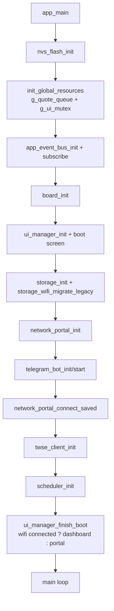
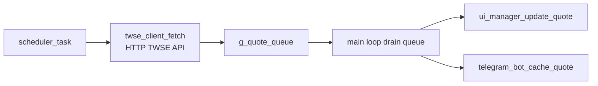
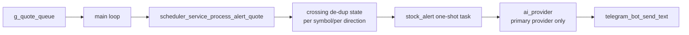
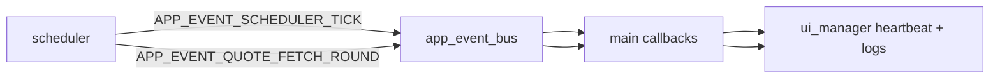
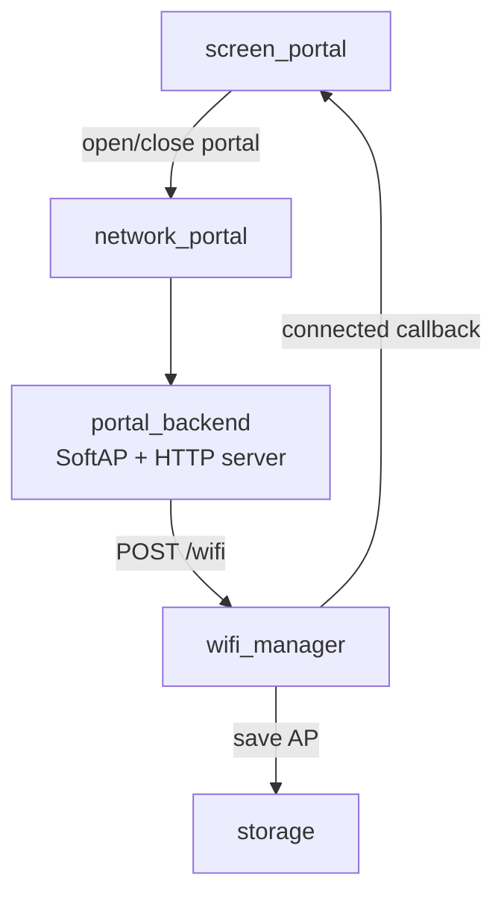
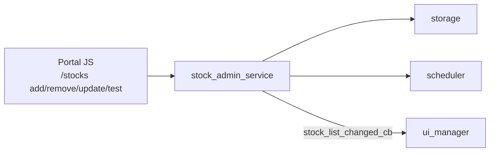

# Core2 韌體資料流圖與結構說明

本文件描述目前程式碼中的「實際」資料與控制流，起點是 `main/app_main()`。

## 1) 系統啟動流程（main -> components）

重點：
- `main` 建立跨模組共享資源：`g_quote_queue`、`g_ui_mutex`。
- `app_event_bus` 目前主要承接 `scheduler` 發出的 heartbeat 與抓價輪次事件，`main` 訂閱後寫入 UI log。
- `network_portal` 是 façade：把呼叫轉給 `wifi_manager` 與 `portal_backend`。
- `ui_manager` 啟動時先顯示 boot screen，透過 progress text 回報初始化進度。
- `ready` 後才進行首畫面分流：已連 WiFi 進 Dashboard，未連 WiFi 進 Portal。

## 2) 報價主資料流（核心管線）

細節：
- `scheduler` 讀取 `storage_stocks_load` 的股票清單，定時呼叫 `twse_client_fetch`。
- `scheduler` 將每筆 `stock_quote_t` push 到 `g_quote_queue`。
- `main` 迴圈批次 drain queue，更新 Dashboard，並同步更新 Telegram quote cache。

## 2.1) Stock Alert 資料流（門檻觸發 AI）

細節：
- `main` 每次消費 quote 時呼叫 `scheduler_service_process_alert_quote()`。
- stock alert 使用「穿越觸發 + 回到門檻內重置」去重，避免連續抓價時重複觸發。
- 休市快照（`is_market_closed=true`）直接略過，不觸發 AI。
- AI 呼叫嚴格使用目前選定 provider（primary only，不做 provider fallback）。
- 送往 AI 的 prompt 組成為：`global_prompt` + `AT_TIME_FIXED_GLOBAL_PROMPT` + `alert_prompt` + quote context。
- AI 成功：Telegram 發送「觸發摘要 + AI 回覆」；失敗：發送單次失敗摘要。

## 3) 事件流（Event Bus）

說明：
- 事件總線是「旁路監控/狀態訊息」，不是主資料管線。
- 主資料仍走 `queue`（`stock_quote_t`）。

## 4) WiFi / Portal 設定流

補充：
- 進入 `SCREEN_PORTAL` 時自動 `portal_backend_start()`（APSTA + HTTP）。
- 若已連 WiFi，Portal 走 STA（不切 mode）；若未連 WiFi，Portal 強制 APSTA（實驗）以支援手機連 Core2 AP 後執行 WiFi scan。
- 離開 `SCREEN_PORTAL` 時自動 `portal_backend_stop()`（回 STA）。
- 未連 WiFi 時，UI 會阻擋切入 `SCREEN_DASHBOARD`，僅允許切到 Portal 與其他非 Dashboard 頁面。

## 5) 股票清單與設定回寫流（Portal API）

說明：
- `/stocks/add`：驗證代號 -> 存 NVS -> `scheduler_reload_stock_list()` -> `scheduler_trigger_quote_now()`。
- `/stocks/remove`：刪除 NVS -> `scheduler_reload_stock_list()`。
- `/stocks/test`：不寫入 NVS，將目前編輯中的門檻與 prompt 送入 scheduler command，走一次完整 AI + Telegram 流程。
- `main` 註冊的 `on_stock_list_changed` 會刷新 Dashboard symbols。

## 6) 模組責任地圖（簡版）

- `main`: 系統編排、主迴圈、queue 消費、跨模組 callback。
- `board`: Core2 硬體初始化與電源/亮度/按鍵輪詢。
- `ui`: LVGL 畫面與互動；透過 mutex 保護 LVGL 呼叫。
- `scheduler`: 定時抓價、市場時段判斷、SNTP/RTC 同步、事件發布。
- `twse_client`: TWSE HTTP + JSON 解析，輸出 `stock_quote_t`。
- `storage`: NVS 永久化（WiFi/AI/Telegram/股票/排程/亮度）。
- `wifi_manager`: STA 連線、掃描、狀態回調。
- `portal_backend` + `stock_admin_service`: SoftAP 網頁與設定 API。
- `telegram_bot`: 背景輪詢指令（`/info`/`/help`）與報價快取回覆。
- `app_event_bus`: 任務間事件廣播（目前偏監控訊號）。
- `ai_provider`: Provider 抽象與 key 測試；目前由 AtTime 與 Stock Alert 流程呼叫。

## 7) 目前容易誤解的點

- `network_portal` 不是完整實作層，它只是 WiFi + Portal 的整合入口。
- `app_event_bus` 定義了多種事件型別，但現階段真正活躍的是 scheduler 相關事件。
- `twse_client_start_task()` 存在，但當前主流程由 `scheduler` 直接呼叫 `twse_client_fetch()`。

## 8) Telegram Token Check（Portal）契約與診斷

### API 契約

- Endpoint: `POST /api/telegram/check`
- Request (`application/x-www-form-urlencoded`):
  - `bot_token`（可選）
- Token 來源規則：
  - 若 body 有 `bot_token` 且非空字串，優先使用 body token。
  - 否則 fallback 到 NVS 已儲存 token。

### 回應語意

- 成功：
  - `{"ok":true,"bot_name":"<name>","username":"<username>"}`
- 失敗（常見）：
  - `missing_token`: body 與 NVS 都沒有可用 token。
  - `invalid_token`: Telegram 回 `401/404`（token 無效）。
  - `connect_failed`: 連線建立失敗（通常 `http=0` + `ESP_ERR_HTTP_CONNECT`）。
  - `check_failed`: 非上述類型失敗，會附 `detail` 便於排查。

### 實作重點（避免 socket 競爭）

- Portal 的 Telegram API（`check/test/chats`）在呼叫前會先做 HTTP 排空：
  - 暫停 `scheduler` quote polling 並等待 quote fetch idle。
  - 暫停 `telegram_bot` polling 並等待 telegram HTTP in-flight 清空。
  - 請求結束後恢復 polling。
- 目的：降低 `esp-tls` 建立 socket 失敗機率（背景 long-poll 與 Portal API 搶資源）。

### 診斷規則（實機 log）

- 若 monitor 出現：
  - `esp-tls: Failed to create socket`
  - `HTTP_CLIENT: Connection failed, sock < 0`
- 優先判定為 socket 建立層問題，不要先當作 token 錯誤或 Telegram API 格式錯誤。

### Kconfig 限制（ESP32 目標）

- `CONFIG_LWIP_MAX_SOCKETS` 在此 target 有有效上限 `16`。
- 嘗試設更高值（例如 `24`）會被 Kconfig 忽略，不能視為已生效調整。
