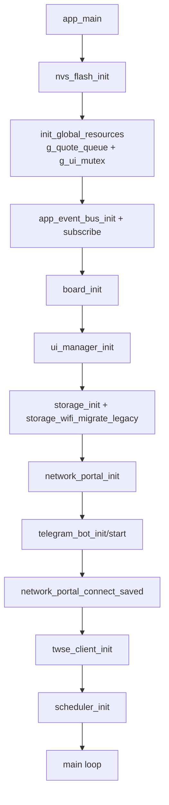
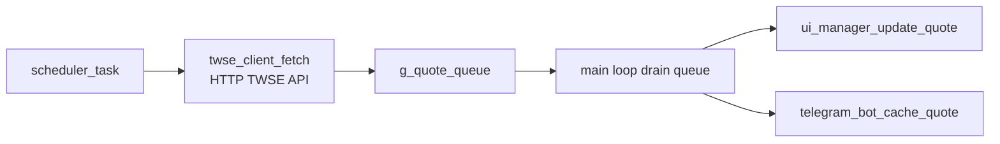
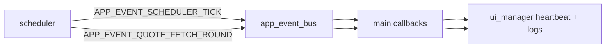
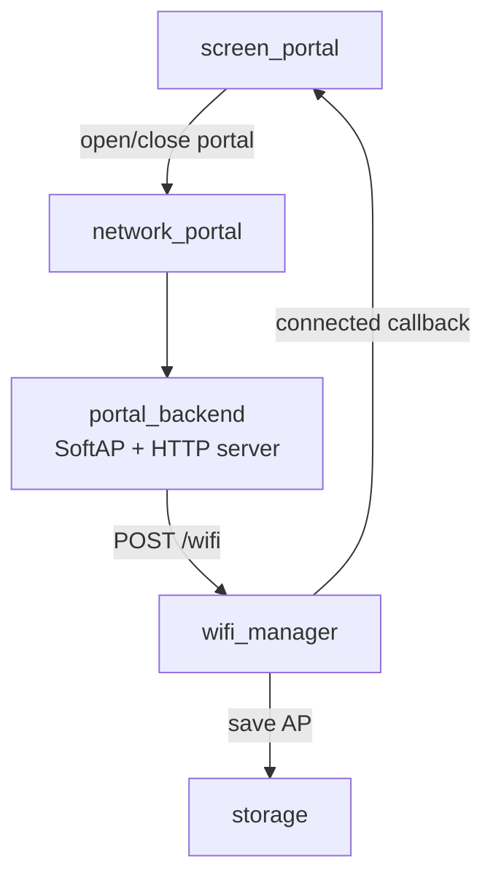
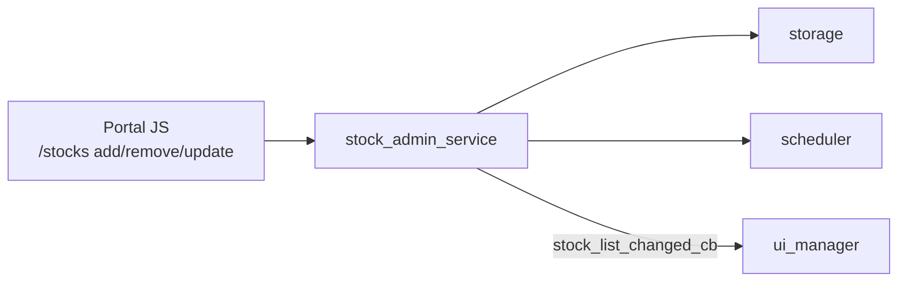

# Core2 韌體資料流圖與結構說明

本文件描述目前程式碼中的「實際」資料與控制流，起點是 `main/app_main()`。

## 1) 系統啟動流程（main -> components）

重點：
- `main` 建立跨模組共享資源：`g_quote_queue`、`g_ui_mutex`。
- `app_event_bus` 目前主要承接 `scheduler` 發出的 heartbeat 與抓價輪次事件，`main` 訂閱後寫入 UI log。
- `network_portal` 是 façade：把呼叫轉給 `wifi_manager` 與 `portal_backend`。

## 2) 報價主資料流（核心管線）

細節：
- `scheduler` 讀取 `storage_stocks_load` 的股票清單，定時呼叫 `twse_client_fetch`。
- `scheduler` 將每筆 `stock_quote_t` push 到 `g_quote_queue`。
- `main` 迴圈批次 drain queue，更新 Dashboard，並同步更新 Telegram quote cache。

## 3) 事件流（Event Bus）

說明：
- 事件總線是「旁路監控/狀態訊息」，不是主資料管線。
- 主資料仍走 `queue`（`stock_quote_t`）。

## 4) WiFi / Portal 設定流

補充：
- 進入 `SCREEN_PORTAL` 時自動 `portal_backend_start()`（APSTA + HTTP）。
- 離開 `SCREEN_PORTAL` 時自動 `portal_backend_stop()`（回 STA）。

## 5) 股票清單與設定回寫流（Portal API）

說明：
- `/stocks/add`：驗證代號 -> 存 NVS -> `scheduler_reload_stock_list()` -> `scheduler_trigger_quote_now()`。
- `/stocks/remove`：刪除 NVS -> `scheduler_reload_stock_list()`。
- `main` 註冊的 `on_stock_list_changed` 會刷新 Dashboard symbols。

## 6) 模組責任地圖（簡版）

- `main`: 系統編排、主迴圈、queue 消費、跨模組 callback。
- `board`: Core2 硬體初始化與電源/亮度/按鍵輪詢。
- `ui`: LVGL 畫面與互動；透過 mutex 保護 LVGL 呼叫。
- `scheduler`: 定時抓價、市場時段判斷、SNTP/RTC 同步、事件發布。
- `twse_client`: TWSE HTTP + JSON 解析，輸出 `stock_quote_t`。
- `storage`: NVS 永久化（WiFi/AI/Telegram/股票/排程/亮度）。
- `wifi_manager`: STA 連線、掃描、狀態回調。
- `portal_backend` + `stock_admin_service`: SoftAP 網頁與設定 API。
- `telegram_bot`: 背景輪詢指令（`/info`/`/help`）與報價快取回覆。
- `app_event_bus`: 任務間事件廣播（目前偏監控訊號）。
- `ai_provider`: Provider 抽象與 key 測試；目前主要由 Portal API 使用。

## 7) 目前容易誤解的點

- `network_portal` 不是完整實作層，它只是 WiFi + Portal 的整合入口。
- `app_event_bus` 定義了多種事件型別，但現階段真正活躍的是 scheduler 相關事件。
- `twse_client_start_task()` 存在，但當前主流程由 `scheduler` 直接呼叫 `twse_client_fetch()`。
